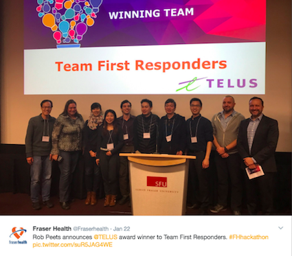
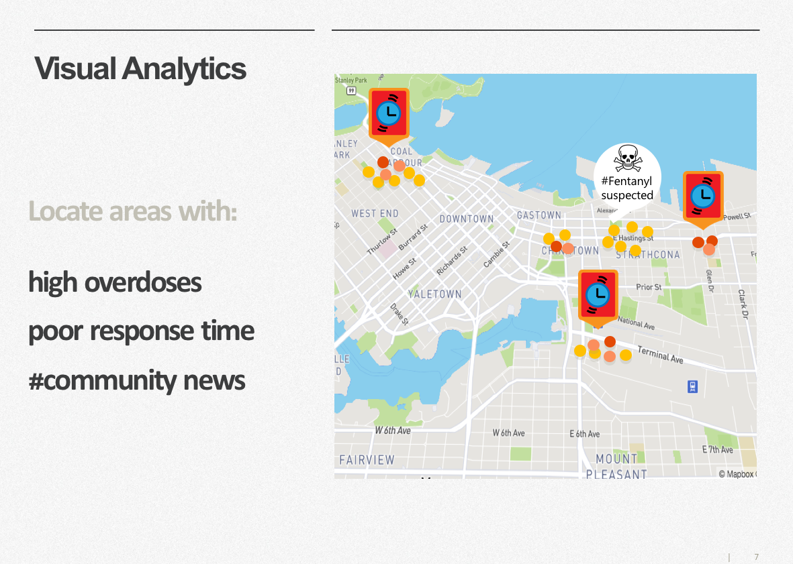
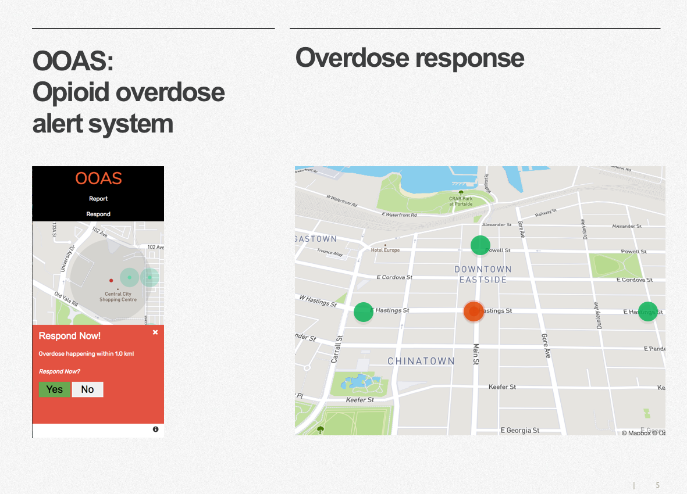

## Fraser Health hackathon 2017

  
[Tweet](https://twitter.com/Fraserhealth/status/823334551074308099)  
[https://www.healthhackathon.ca/](https://www.healthhackathon.ca/)  

  
Winning Team: Team First Responders 

1. Dr. Charlie Lamb 
2. Tamara Wojdylo
3. David Choy
4. Sean Bergunder
5. Kenny Louie
6. Anna Wang
7. Carmen Chow
8. Feng Ge
9. Peter Chin
10. Lily Yang 

Tech used:  

1. Twilio
2. Mapbox GL JS

Sample mapbox:  

[Link to mapbox static demo using mock overdose data](https://hochoy.github.io/fraserhealth/html_pages/fraser_analytics.html)  
[Link to mapbox moving demo using mock user data](https://hochoy.github.io/fraserhealth/html_pages/fraser_respond.html)

***  
  
The 2016 opioid overdose crisis was responsible for over 900 drug-related deaths n 2016, triggering a reaction from the public, BC politicians and the health authorities. Although a [recent report](http://www2.gov.bc.ca/assets/gov/public-safety-and-emergency-services/death-investigation/statistical/illicit-drug.pdf) has been published by the BC Coroner's office, health authorities and nonprofit volunteers say that the information is often too late for them to act. Due to the sensitive nature of the coroner's data, hospitals only receive information about contaminants and spikes in overdoses when the cause of death has been officially determined. That process takes weeks to months. Furthermore, hospitals and nonprofit drug clinics say that there is a higher percentage of unreported overdoses than reported overdoses because drug users often avoid the hassle that comes with reporting.  
  
***
  
  
  
***  
  
For the 2017 Fraser Health hackathon, our team decided to tackle the challenge of using Open Data to help health authorities solve the Opiod Overdose crisis. Our intial plan was to extract open datasets from BC's provincial and municipal data portals. Unfortunately, none of the teams during the hackathon was able to find any overdose incident information from the datasets even with the help of health officials present at the event.  

  

We realized that we needed to crowdsource that information at the source and thus, we designed a mobile app prototype that served as both a "Call for Help" panic button as well as a data-gathering platform. Our app could alert nearby volunteers and naloxone holders to a drug overdose. Overtime, we collect information of when and where overdoses are happening and that crowdsourced information becomes a valuable tool in increasing overdose response times and helping hospitals allocate manpower and resource.  

### Project status  
Under active development as of February 2017  

***

